**Tugas 5**

**“Instalasi dan Konfigurasi Web Server, Database Server, dan Mail Server”**

**Disusun Untuk Memenuhi Tugas Mata Kuliah**

` `Workshop Administrasi Jaringan

**Dosen Pengampu : Dr Ferry Astika Saputra ST, M.Sc**

Disusun oleh :

Handaru Dwiki Yuntara 

3122500017

2 D3 IT A

***Program Studi Teknik Informatika***

***Department Teknik Informatika dan Komputer***

***Politeknik Elektronika Negeri Surabaya***

1. NTP SERVER 
1. Installasi paket sinkronisasi 

   

1. Konfigurasi timezone, RTC, dan NTP client

   

1. Menyunting file timesyncd.conf untuk mengarah ke NTP server terdekat untuk mendapatkan waktu delay terpendek. Biasanya setiap organisasi atau negara mempunyai NTP Server sendiri → sudo nano /etc/systemd/timesyncd.conf

   

1. Restart dan cek status

   

1. Lakukan pengecekan kesesuaian tanggal

   

1. Menampilkan status sinkronisasi

   

1. **Apache 2 dan PHP-FM**
1. Install apache 2

   

1. Melakukan konfigurasi apache 2
- sudo nano /etc/apache2/conf-enabled/security.conf

  

- sudo nano /etc/apache2/moa/ds-enabled/dir.conf

  

- sudo nano /etc/apache2/apache2.conf

  

- sudo nano /etc/apache2/sites-enabled/000-default.conf

  

- reload apache

  

1. Melakukan test ke web server

   

1. Install PHP 8.2

   

1. Cek versi php

   

1. Test PHP

   

   

1. Install PHP-FM

   

1. Konfigurasi file /etc/apache2/sites-available/default-ssl.conf dengan menambahkan yang dikotaki merah

   

1. Akktifkan modul-modul proxy\_fcgi dan setenvif dalam server Apache.

   

1. Mengaktifkan modul php8.2-fpm

   

1. Restart Sevice php

   

1. Test validasi

1. Melakuka test ke browser membuka file php.ini

   

1. Maria DB dan PHPMyAdmin
1. Install mariadb

   

1. Konfigurasi  /etc/mysql/mariadb.conf/50-server.cnf

   

   Pada line 95 --> Mengkonfirmasi default charset menggunakan utf8mb4.

1. Restart Mariadb

   

1. ` `Inisial Konfigurasi dan testing database MariaDB Server - sudo mysql\_secure\_installation

   

- Connect to mariadb

- Menampilkan hak akses yang dimiliki oleh user roo

- Menampilkan semua daftar user

- Melihat semua databsase

- Membuat databse test\_db

- Membuat table test\_table

- Memasukkan 1 row ke table

- Menampilkan isi table test

- Menghapus database test\_db

1. Install phpMyAdmin

   

   
**

`	`****

1. Melakukan konfigurasi phpMyAdmin di apache2

   

1. Coba membuka phpMyAdmin di web browser

   

   

1. Menambahkan privillege ke user phpmyadmin - Login ke mariadb → sudo mariadb -u root -p - Lalu berikan hak akses penuh kepada user phpmyadmin → GRANT ALL PRIVILEGES ON \*.\* TO 'phpmyadmin'@'localhost' IDENTIFIED BY 'password' WITH GRANT OPTION; FLUSH PRIVILEGES;

   

   

1. **Email System**
1. Install postfis sasl2-bin

   

   

   

   Pilih no configuration

1. Mencopy file /usr/share/postfix/main.cf.dist ke /etc/postfix/main.cf --> sudo cp /usr/share/postfix/main.cf.dist /etc/postfix/main.cf

   

1. Konfigurasi file /etc/postfix/main.cf
- Uncomment line 82

  

  - uncomment line 98 dan isi dengan email hostname kelompok4.local

  

- Uncomment line 106 dan isi dengan hostname kelompok6

  

- Uncomment line 127

  

- Uncomment line 141

  

- Uncomment line 189

  

- Uncomment line 232

  

- Uncomment line 277
- 

- Uncomment line 294 dan tambahkan local network

- Uncomment line 416

  

- Uncomment 427

  

- uncomment line 

  

- Comment line 558 dan tambahkan di line 589 konfigurasi smtpd\_banner

  

- Tambahkan sendmail\_path di line 659

  

- Tambahkan newaliases\_path di line 664

  

- Tambahkan sedgid grup di line 675

  

- Comment line 679

  

- Comment line 683 dan 688

  

- ` `Comment line 692 dan tambahkan inet\_protocol

  

- Menambahkan config di line terakhir. Yaitu mematikan SMTP VRFY command, require HELO command to sender hosts, Mengatur limit an email size, dan mengatur SMTP-Auth settings

  

1. Update database alias untuk system postfix

   

1. Restart layanan postfix

   

1. Menambahkan konfigurasi anti spam

   

1. Restart lagi

   

1. Install Dovecot IMAP4 (TCP 143) and POP 3 (TCP10)

   

1. Konfigurasi file /etc/dovecot/dovecot.conf

   

1. Konfigurasi file /etc/dovecot/conf.d/10-auth.conf

   

1. Uncomment line 10 dan izinkan plain text auth tambahkan auth\_mechanism

   

1. Konfigurasi file /etc/dovecot/conf.d/10-mail.conf

   

 

1. Konfigurasi file /etc/dovecot/conf.d/10-master.conf

   

1. ` `Restart dovecot

   

1. Check all service 

Akan terlihat hasilnya dengan status Server (LISTEN) : MariaDB(MySQL), IMAP, POP3, DNS(domain - http), IMAPS, POP3S, SSH, Postfix (SMTP)

1. Cek terhadap layanan postfix

   

1. Install thunderbird

   

   

1. Tambahkan user untuk saling email

   

1. Email dari user handaru ke ari

   

1. Email udah masuk di ari

   

1. **Roundcube Webmail**
1. Membuat database yang nantinya digunakan untuk roundcube

   

1. Install roundcube

   

1. Masuk ke direktori roundcube

   

1. Mengimpor file mysql ke dalam database roundcube dengan menggunakan akun pengguna (-u roundcube) dan database (-D roundcube) yang sesuai. --> sudo mysql -u roundcube -D roundcube -p < mysql dan masukkan password mariaDB user roundcube (password)

   

1. Melakukan set database informasi  pada file /etc/roundcube/Debian-db.php

   

1. Konfigurasi file /etc/roundcube/config.inc.php

   

1. Konfigurasi file /etc/apache2/conf-enabled/roundcube.conf

   

1. Test kirim email antar user 
- User handaru kirim email ke user ari

- User ari menerima email

  

# PRAKTIKUM MENGUNAKAN WEBMAIL DALAM 1 JARINGAN

## SETUP AWAL

Pertama-tama sambungkan komputer dengan kabel ethernet lokal yang tersedia. Setelah tersambung dengan jaringan lokal pastikan IP sesuai dengan kelompok/meja gunakan command `ipconfig/all` pada kasus ini saya mendapatkan IP `192.168.4.1` karena saya merupakan kelompok 4

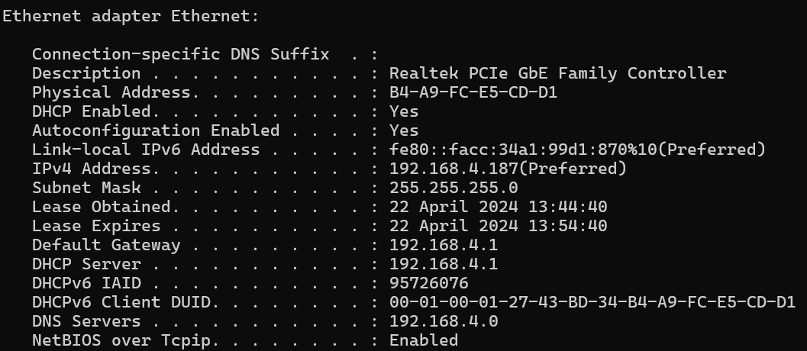

Lalu ubah pada setting network pada virtual machine ke Bridged Adapter dan ganti adapter sesuai dengan hasil command `ipconfig/all` yaitu `Realtek PCIe GbE Family Controller`

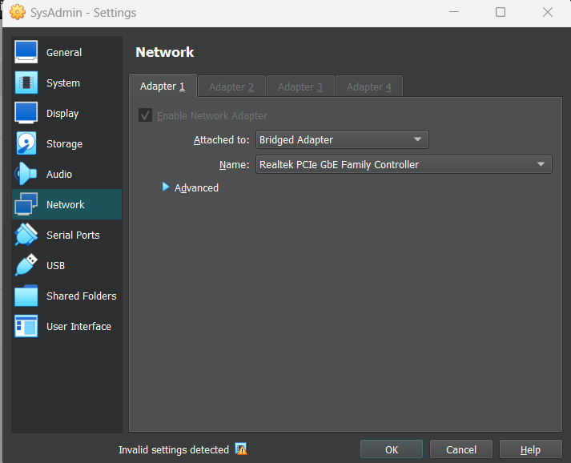

## SETUP DEBIAN 12

Jalankan VM anda lalu pergi ke `sudo nano /etc/bind/named.conf.options`
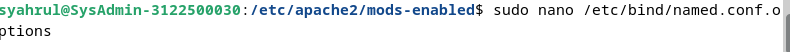

Rubah konfigurasi forwarders dengan `10.10.10.1` dan `192.168.4.10` ganti IP listen on ke `192.168.4.10` terakhir ganti konfigurasi `allow-query` dan `allow-recursion `ke `any`. Konfigurasinya akan menjadi seperti berikut:

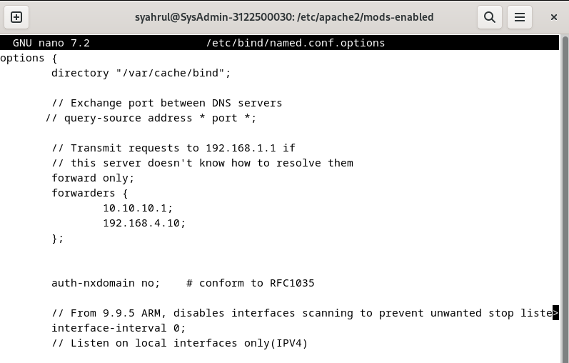
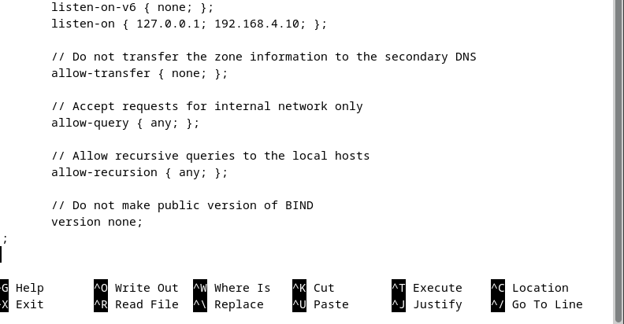

Rubah juga konfigurasi di `sudo nano /etc/resolv.conf` tambahkan `nameserver 192.168.4.10` seperti dibawah berikut:

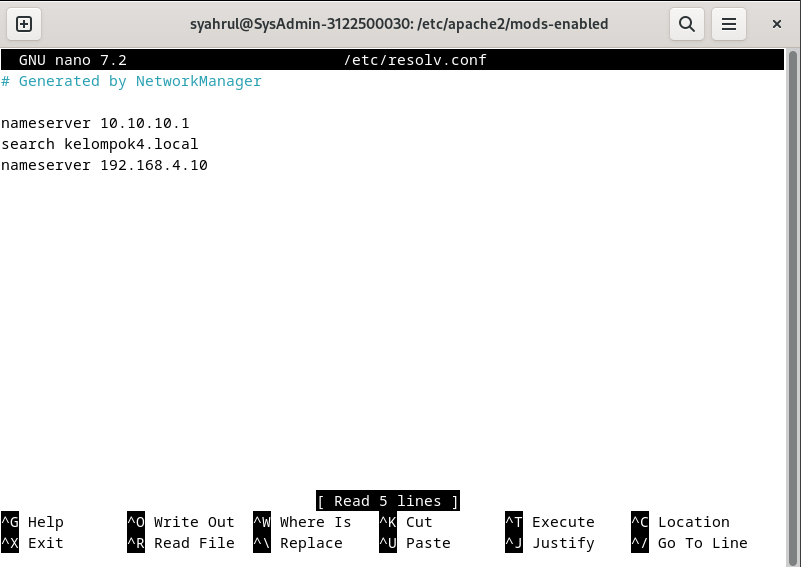

Setelah itu coba tes ping IP kelompok lain yaitu kelompok 2 dengan command `ping 192.168.2.10` jika konfigurasi network benar maka maka hasilnya akan seperti berikut:

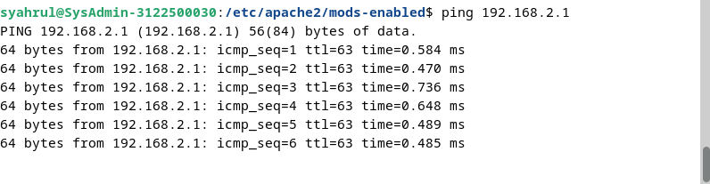

Coba juga tes ping ke sebagai contoh `detik.com` dengan command `ping detik.com` jika konfigurasi network benar maka akan seperti dibawah ini:

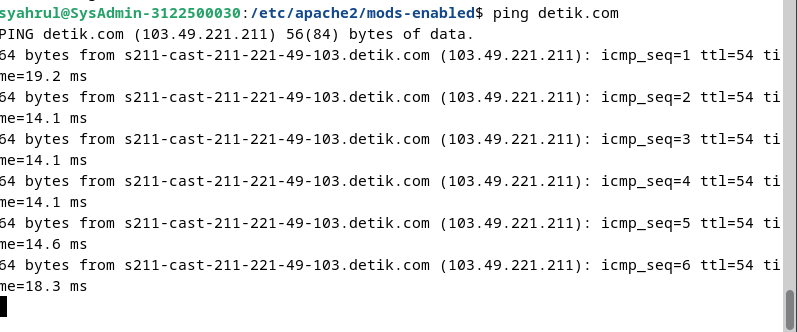

Buka browser dan coba test apakah bisa mengakses webmail (roundcube) kelompok lain disini saya mencoba mengakses ke webmail kelompok 2 dengan alamat `mail.kelompok2.local` Jika berhasil maka akan tampil seperti berikut:

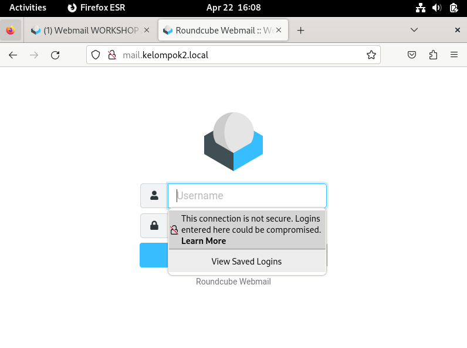

Buka browser dan coba test apakah bisa mengakses webmail (roundcube) dengan alamat `mail.kelompok4.local/roundcube` Jika berhasil maka akan tampil seperti berikut:

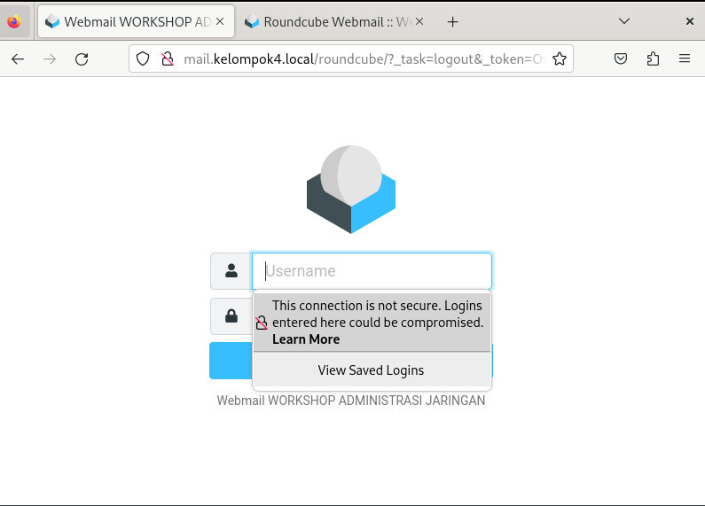

Jika network static tidak bekerja dan tidak bisa tampil seperti diatas maka coba buka `sudo nano /etc/network/interfaces` buat auto network dengan mengcomment konfigurasi static pada seperti dibawah ini:

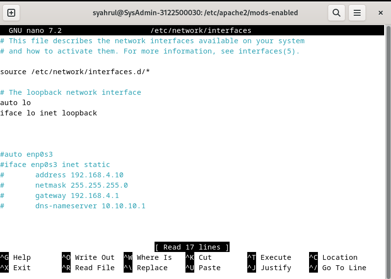

Lalu setup manual IPv4 dengan IP addres `192.168.4.10` netmask `255.255.255.0` gateway `192.168.4.1` dan DNS `10.10.10.1`

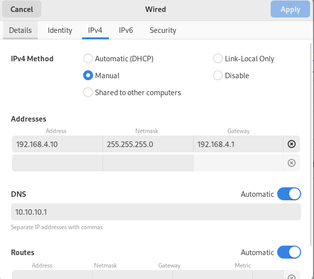

## KONFIGURASI WINBOX

Buka winbox di windows lalu pergi ke menu bridge. Setelah itu remove bridge yang ada dan buat baru. langsung next next saja hingga bertemu setting DNS inputkan `10.10.10.1`

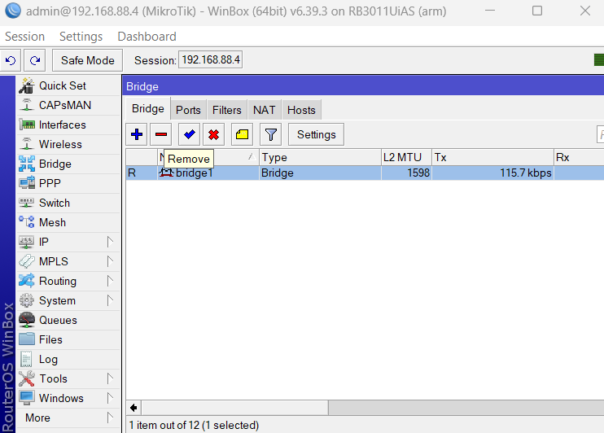

## HASIL AKHIR

Login ke rouncube dengan user dan password yang sudah disetup. pada kasus ini saya bisa menerima pesan dari user `iqbal@kelompok6.local` seperti pada gambar dibawah ini:

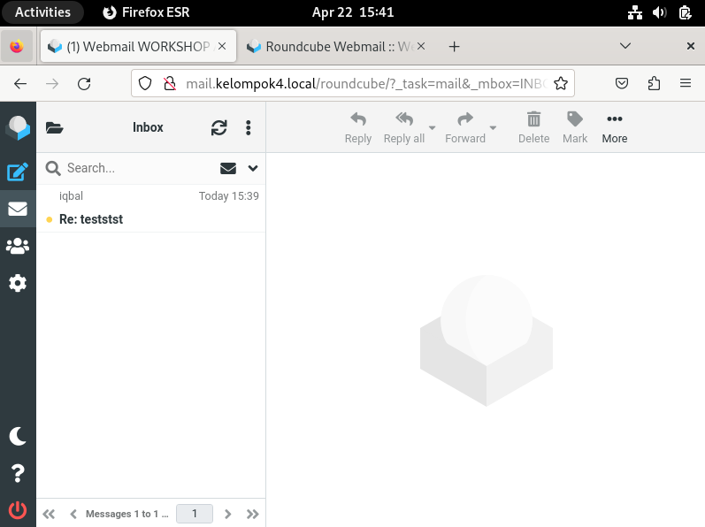
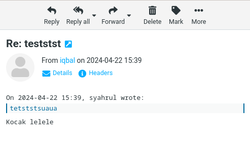

Disini saya ingin mencoba mengirim pesan email ke `user@kelompok2.local` dan berhasil
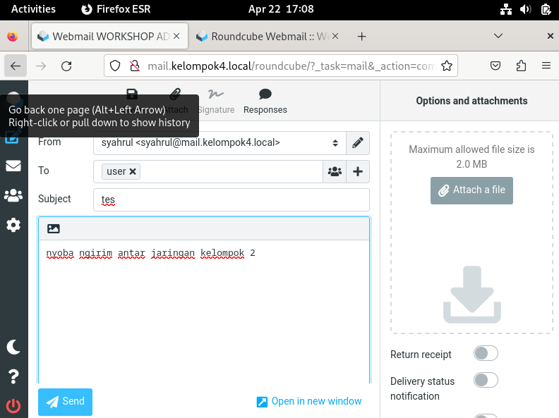

# TELNET

Pertama tama masuk ke Terminal lalu ketikan command ``telnet 192.168.4.10 25`` atau ``telnet mail.kelompok4.local`` setelah itu masukan command ``ehlo kelompok4.local`` seperti dibawah berikut:

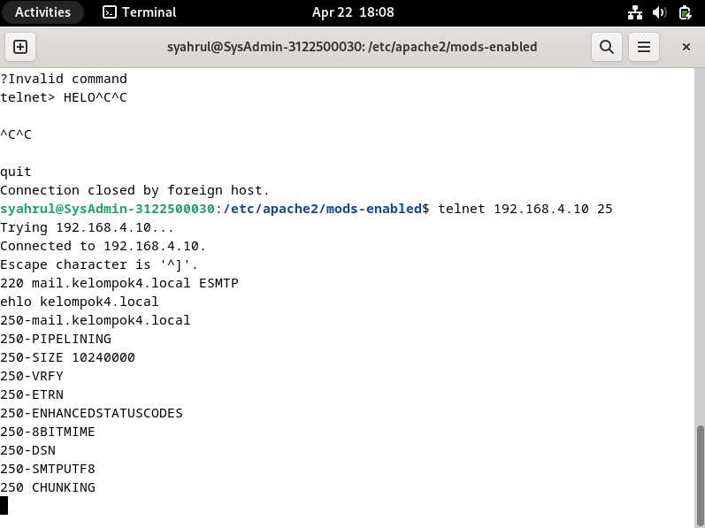

Ketikan dengan format email:

    MAIL FROM: <alamat email anda>
    RCPT TO: <tujuan alamat email anda>

Setelah itu tekan enter untuk mendapatkan pesan ``250 2.1.5 Ok``
Lalu Masukan:
        
    DATA

Tekan enter dan masukan isi email dengan format:

    From: <nama pengirim>
    To: <tujuan pengirim>
    Date: <Tanggal pengiriman>
    Subject: <subject pesan>

Setelah menekan enter masukan pesan anda jika selesai tekan ``ctrl+c`` maka pesan terkirim
      
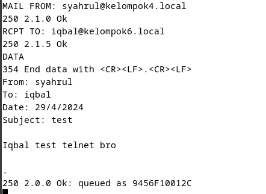

# Header MIME Analysis

Analysis Header Text mail Roundcube

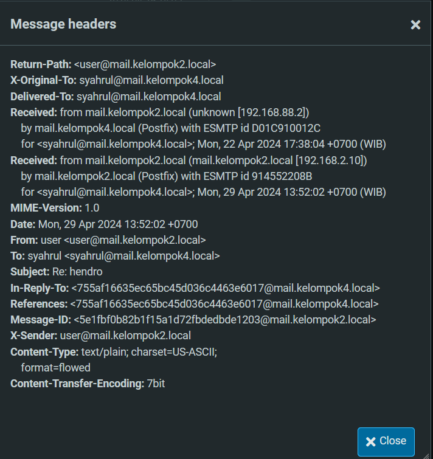

1. **Return-Path**: Menunjukkan alamat email tempat bounce atau kegagalan pengiriman akan dikirimkan. Di sini, diatur ke user@mail.kelompok2.local.

2. **X-Original-To**: Menunjukkan penerima asli email sebelum ada proses penerusan atau pemrosesan daftar mailing. Di sini, menunjukkan syahrul@mail.kelompok4.local.

3. **Delivered-To**: Menunjukkan alamat email di mana email akhirnya dikirimkan. Cocok dengan bidang X-Original-To, yaitu syahrul@mail.kelompok4.local.

4. **Received**: Menunjukkan jalur yang ditempuh email untuk mencapai kotak surat penerima. Ada dua header Received dalam gambar ini:

    - Yang pertama menunjukkan bahwa email berasal dari mail.kelompok2.local dengan alamat IP 192.168.88.2. Ini menunjukkan bahwa email dikirim secara internal dalam jaringan lokal.
    - Yang kedua menunjukkan bahwa email diterima oleh mail.kelompok4.local pada tanggal 29 April 2024, pukul 13.52 WIB.

5. **MIME-Version**: Menentukan versi standar Multipurpose Internet Mail Extensions (MIME) yang digunakan dalam email. Di sini, diatur ke 1.0.

6. **Date**: Menunjukkan tanggal dan waktu email dikirim. Cocok dengan penanda waktu di header Received kedua, yaitu 29 April 2024, pukul 13.52 WIB.

7. **From**: Menunjukkan pengirim email. Menunjukkan "user" <user@mail.kelompok2.local>, yang berarti email dikirim oleh pengguna bernama "user" dengan alamat email user@mail.kelompok2.local.

8. **To**: Menentukan penerima email. Menunjukkan "syahrul" <syahrul@mail.kelompok4.local>, yang menunjukkan bahwa email dikirim kepada seseorang bernama "syahrul" dengan alamat email syahrul@mail.kelompok4.local.

9. **Subject**: Mengandung baris subjek email, yaitu "Re: hendro". Ini menunjukkan bahwa email ini merupakan balasan terhadap email dengan subjek "hendro".

10. **In-Reply-To**: Referensi pesan ID email yang email ini membalasnya. Nilainya adalah <755af16635ec65bc45d036c4463e6017@mail.kelompok4.local>.

11. **References**: Header ini digunakan untuk menentukan email terkait, seperti email sebelumnya dalam sebuah percakapan. Di sini, merujuk pada ID pesan yang sama dengan header In-Reply-To, menunjukkan bahwa email ini merupakan bagian dari percakapan tentang email dengan ID <755af16635ec65bc45d036c4463e6017@mail.kelompok4.local>.

12. **Message-ID**: Unik mengidentifikasi pesan email. Ini adalah <5e1fbf0b82b1f15a1d72fbdedbde1203@mail.kelompok2.local>.

13. **X-Sender**: Header ini tidak merupakan bagian dari format email standar tetapi mungkin digunakan oleh beberapa server email untuk menentukan alamat email pengirim. Di sini, cocok dengan bidang Dari, diatur ke user@mail.kelompok2.local.

14. **Content-Type**: Menentukan format konten email. Di sini, diatur ke text/plain; charset=US-ASCII; format=flowed, menunjukkan bahwa isi email adalah teks biasa yang dienkripsi dalam set karakter US-ASCII dan diformat untuk tampilan teks yang dapat mengalir.

15. **Content-Transfer-Encoding**: Menentukan encoding yang digunakan untuk konten email. Di sini, diatur ke 7bit, menunjukkan bahwa teks dienkripsi menggunakan set karakter 7-bit, yang cocok untuk sebagian besar karakter umum.

Analysis Header Image mail Roundcube

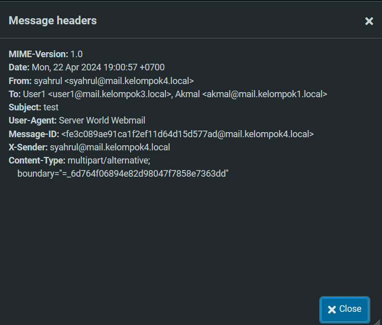

1. **Message-ID**: Header ini memberikan pengenal unik untuk email tersebut. ID pesan dari email ini adalah <fe3c089ae91ca1f2ef11d64d15d577ad@mail.kelompok4.local>.

2. **Date**: Header ini menunjukkan tanggal dan waktu email dikirim. Email ini dikirim pada hari Senin, 22 April 2024, pukul 19.00 WIB.

3. **From**: Header ini menunjukkan pengirim email. Bidang Dari menunjukkan "syahrul" dengan alamat email syahrul@mail.kelompok4.local.

4. **To**: Header ini menentukan penerima email. Dalam kasus ini, ada dua penerima:

    - "User1" dengan alamat email user1@mail.kelompok3.local
    - "Akmal" dengan alamat email akmal@mail.kelompok1.local

5. **Subject**: Header ini berisi baris subjek email, yaitu "test".

6. **User-Agent**: Header ini menentukan perangkat lunak atau klien email yang digunakan untuk mengirim email. Di sini, User-Agent adalah "Server World Webmail".

7. **MIME-Version**: Header ini menentukan versi MIME yang digunakan dalam email. Di sini, digunakan versi MIME 1.0.

8. **Content-Type**: Header ini menentukan format konten email. Jenis konten adalah multipart/alternative; boundary="_6d764f06894e82d98047f7858e7363dd", yang menunjukkan email multipart yang berisi bagian-bagian alternatif. String batas spesifik memisahkan bagian-bagian ini.

