<h1 align="center">
LAPORAN PRAKTIKUM WORKSHOP

**ADMINISTRASI JARINGAN**

</h1>

“Architecture Web Server & Web Browser”

    

<h4 align="center">

Disusun Oleh:

**Gede Hari Yoga Nanda  					3122500005**

**Handaru Dwiki Yuntara     				3122500017**

**Muhammad Syahrul Ramadhan				3122500030**

</h4>

<h3 align="center">

2 D3 INFORMATIKA A

DEPARTEMEN TEKNIK INFORMATIKA DAN KOMPUTER JURUSAN TEKNIK INFORMATIKA
POLITEKNIK ELEKTRONIKA NEGERI SURABAYA

2023/2024

</h3>

<h2>Architecture Web Sever & Web Browser</h2>

</img>

1. **Web Browser:**
   1. Web browser adalah aplikasi perangkat lunak yang diinstal di perangkat pengguna seperti komputer, ponsel, atau tablet.
   2. Browser memungkinkan pengguna untuk menjelajah internet dengan mengakses halaman web melalui protokol HTTP atau HTTPS.
   3. Ketika pengguna memasukkan URL atau melakukan pencarian, browser mengirimkan permintaan ke web server yang menghosting situs web yang diminta.
   4. Browser kemudian menerima respons dari web server, yang berisi kode HTML, CSS, JavaScript, dan konten lainnya yang membentuk halaman web.
   5. Browser menggunakan rendering engine untuk menguraikan kode tersebut dan menampilkan halaman web kepada pengguna dengan antarmuka pengguna yang sesuai.
2. **Web Server:**
   1. Web server adalah perangkat lunak yang berjalan di server dan menyimpan berbagai situs web.
   2. Web server menerima permintaan dari web browser melalui protokol HTTP atau HTTPS.
   3. Setelah menerima permintaan, web server mengambil halaman web yang diminta dari sistem file atau basis data server.
   4. Web server kemudian mengirimkan halaman web tersebut kembali kepada browser yang melakukan permintaan.
   5. Selain mengirimkan konten, web server juga dapat menangani proses seperti otentikasi pengguna, penyimpanan sesi, atau log aktivitas.

<h2>Perbedaan dan Peran Server Aplikasi dan Server Web:</h2>
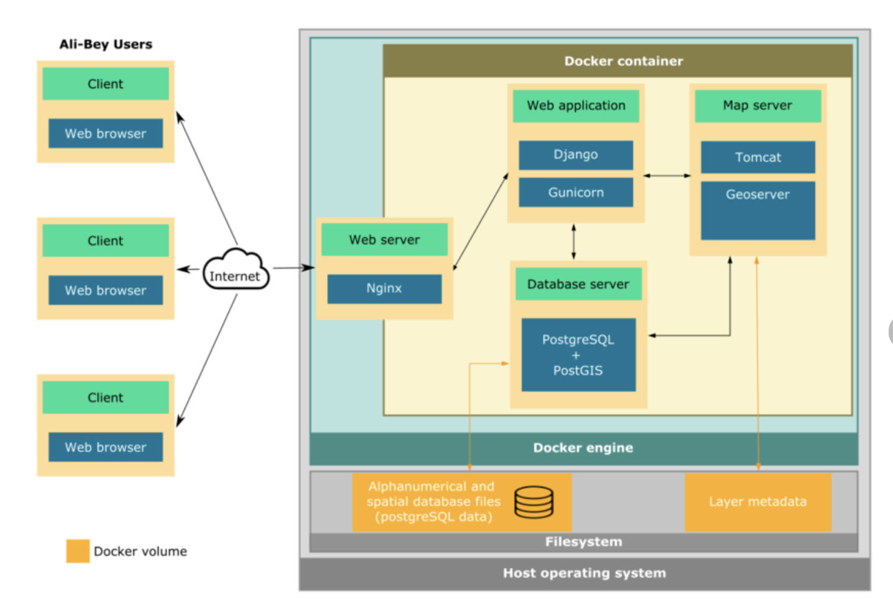</img>
**Server Aplikasi:**
1. **Protokol Lebih dari HTTP:** 
   - Server aplikasi mampu bekerja dengan berbagai jenis protokol selain HTTP, memungkinkannya untuk menangani berbagai jenis program.
2. **Fungsionalitas Tambahan:** 
   - Selain menjalankan permintaan HTTP, server aplikasi menawarkan kemampuan tambahan yang memperluas fungsionalitasnya, seperti transaksi, personalisasi, dan layanan pesan.
3. **Komponen Penting dalam Layanan:** 
   - Server aplikasi seringkali mengintegrasikan server web sebagai bagian penting dari layanannya, memungkinkan untuk memberikan fitur tambahan dan menangani permintaan yang lebih kompleks.
4. **Manajemen Situs Web yang Efektif:** 
   - Dalam pengelolaan situs web, kombinasi antara server aplikasi dan server web sering memberikan hasil yang lebih baik, dengan server web menangani permintaan dasar dan konten statis, sementara server aplikasi menangani permintaan yang lebih dinamis.

**Server Web:**
1. **Fokus pada HTTP:** 
   - Server web secara khusus menjalankan permintaan HTTP untuk menampilkan halaman web kepada pengguna.
2. **Fungsi Utama Terbatas:** 
   - Meskipun server web bisa menyediakan fitur tambahan seperti penyimpanan sementara, fungsinya utamanya adalah menjalankan permintaan HTTP untuk menampilkan halaman web.
3. **Universal dalam Penyajian Konten:** 
   - Server web menyajikan konten yang sama kepada pengguna tanpa memandang lokasi atau perangkat pengguna, memungkinkan pengguna mengakses halaman web dengan mudah.
4. **Dukungan untuk Teknologi Adaptif:** 
   - Meskipun server web dapat menyajikan konten statis dengan baik, halaman web dengan komponen adaptif biasanya didukung oleh teknologi lain selain server web.
  

# Docker

Pertama tama jalankan perintah `for pkg in docker.io docker-doc docker-compose podman-docker containerd runc; do sudo apt-get remove $pkg; done` untuk menghapus package docker yang tidak diperlukan

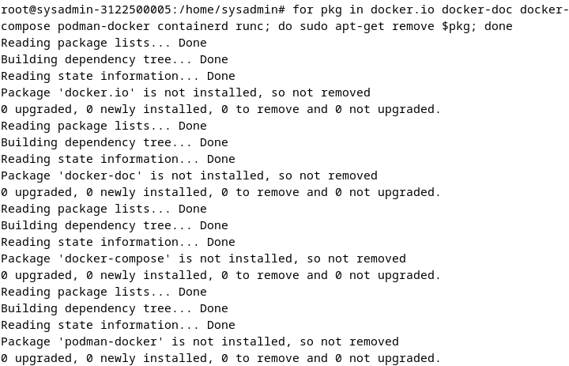

Jalankan perintah `sudo apt-get update` untuk update debian dan jalankan untuk install docker engine `sudo apt-get install ca-certificates curl`

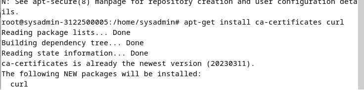

Lalu install keyrings untuk docker dengan command

      sudo install -m 0755 -d /etc/apt/keyrings
      sudo curl -fsSL https://download.docker.com/linux/debian/gpg -o etc/apt/keyrings/docker.asc
      sudo chmod a+r /etc/apt/keyrings/docker.asc

dan juga add repository ke apt sources 

      echo \
      "deb [arch=$(dpkg --print-architecture) signed-by=/etc/apt/keyrings/docker.asc] https://download.docker.com/linux/debian \
      $(. /etc/os-release && echo "$VERSION_CODENAME") stable" | \
      sudo tee /etc/apt/sources.list.d/docker.list > /dev/null
      sudo apt-get update

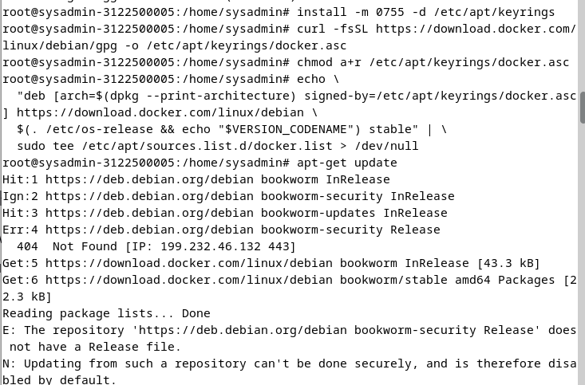

Install Docker CE dengan perintah `sudo apt-get install docker-ce docker-ce-cli containerd.io docker-buildx-plugin docker-compose-plugin` Lalu pilih yes semua

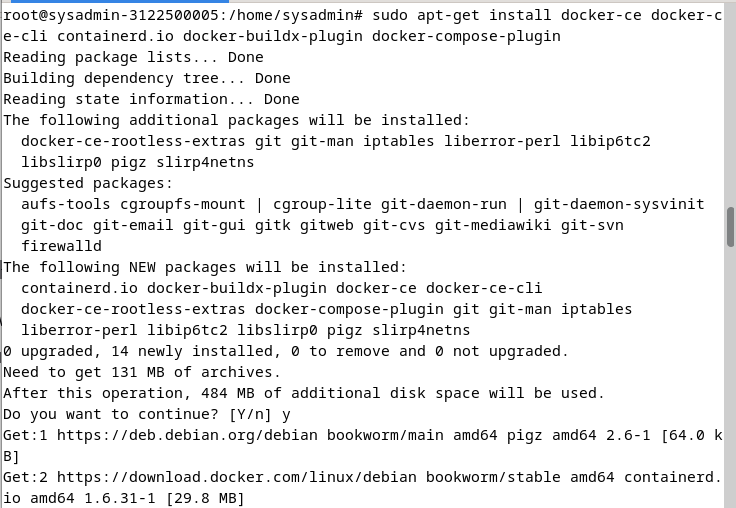

selesai instalasi, coba docker run hello world karena unnable fine, jadi otomatis akan pull

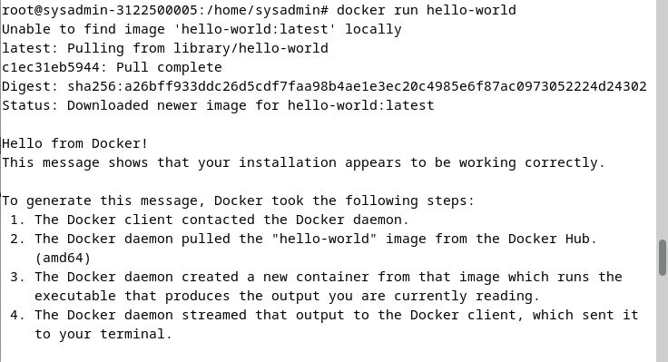

coba cek container dengan perintah `docker ps -a`

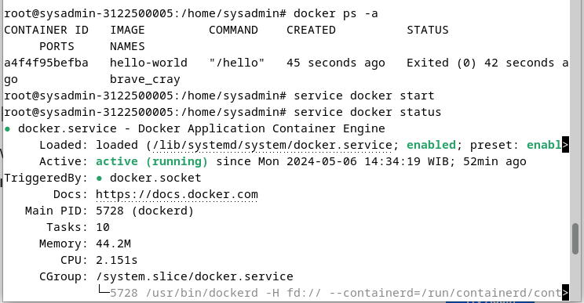

# Instalasi UPTIME-KUMA

instalasi kuma dengan membuka dokumentasi di github nya uptime-kuma dan lakukan instalasi https://github.com/louislam/uptime-kuma

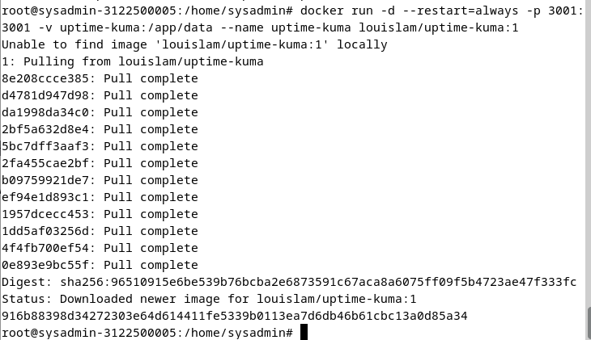

lalu setelah berhasil, coba buka dengan url `localhost:3001 `

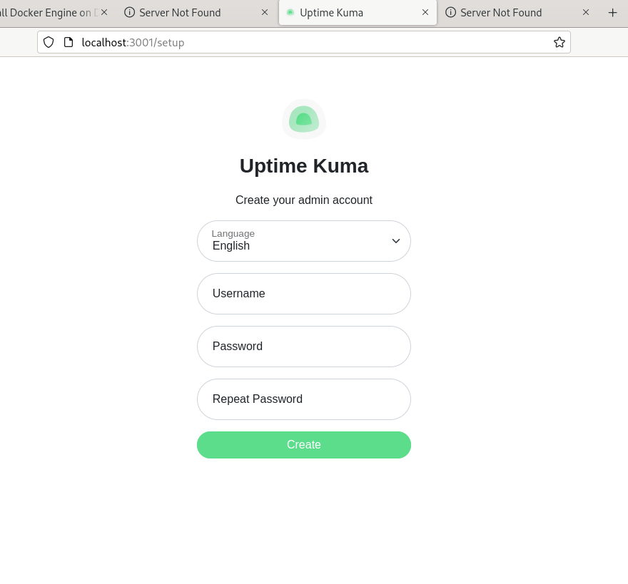

# Monitoring 

Pergi ke `sudo nano /var/lib/bind/db.kelompok4.local` tambahkan setingan monitoring seperti pada dibawah berikut:

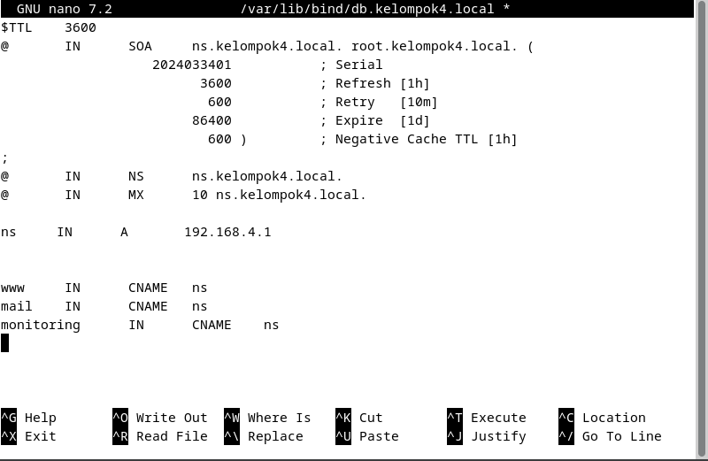

Lalu jalankan perintah `sudo a2enmod` dan Masukkan Package berikut:
`proxy proxy_ajp proxy_http rewrite deflate headers proxy_balancer proxy_connect proxy_html`

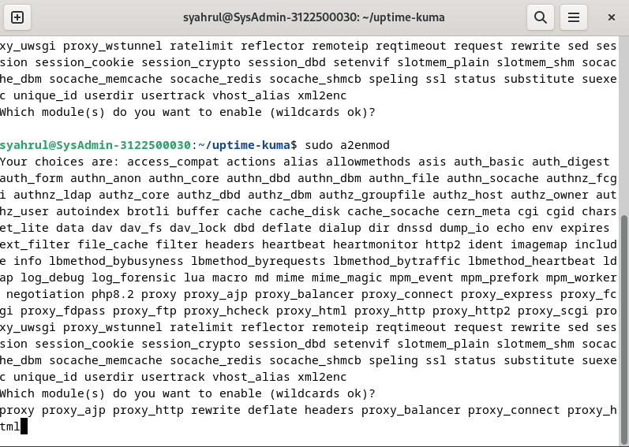

Pergi ke `sudo nano /etc/apache2/sites-enabled/000-default.conf` lalu konfigurasi seperti dibawah berikut:

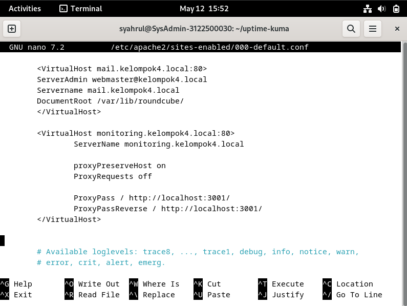

Maka hasilnya akan seperti ini:

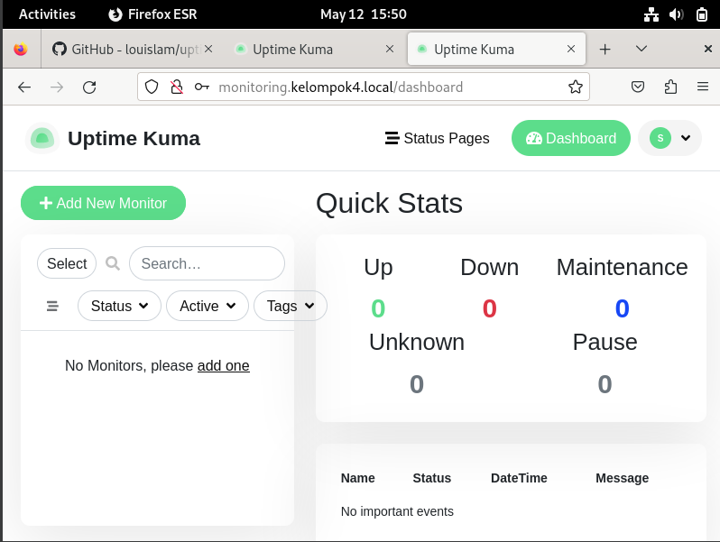