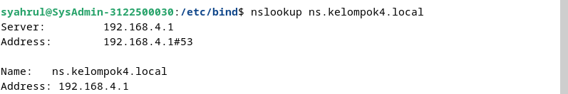
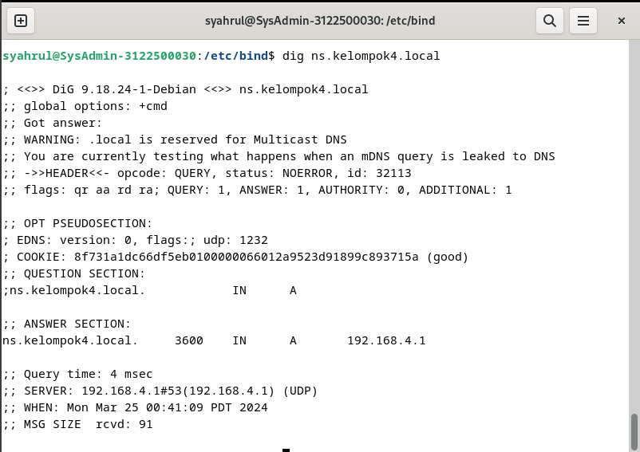

<h1 align="center">
LAPORAN PRAKTIKUM WORKSHOP

**ADMINISTRASI JARINGAN**

</h1>

“Instalasi DNS Server dan Ekosistem Internet”

    

<h4 align="center">

Disusun Oleh:

**Gede Hari Yoga Nanda  					3122500005**

**Handaru Dwiki Yuntara     				3122500017**

**Muhammad Syahrul Ramadhan				3122500030**

</h4>

<h3 align="center">

2 D3 INFORMATIKA A

DEPARTEMEN TEKNIK INFORMATIKA DAN KOMPUTER JURUSAN TEKNIK INFORMATIKA
POLITEKNIK ELEKTRONIKA NEGERI SURABAYA

2023/2024

</h3>

# EKOSISTEM INTERNET

Pengertian:  
Internet adalah hasil dari kemitraan global yang melibatkan berbagai aspek, termasuk teknologi, standar, organisasi, dan entitas yang bekerja sama untuk mendukung pengembangan dan operasionalnya. Kunci kesuksesan internet termasuk kepemilikan global bersama, jadii tidak ada yang memiliki internet.    pengembangan standar terbuka, dan ketersediaan proses pengembangan teknologi dan kebijakan yang transparan dan terbuka untuk diakses oleh semua pihak. Semua orang bebas menggunakan internet.

Cara Kerja Internet:  
Internet secara teknis melibatkan sistem routing yang mengatur aliran data antara jaringan, serta sistem penamaan domain (DNS) yang menerjemahkan nama domain menjadi alamat IP. Organisasi standar seperti Internet Engineering Task Force (IETF) memainkan peran penting dalam mengembangkan dan memelihara standar internet yang diperlukan untuk interoperabilitas global. Penyedia layanan internet, termasuk penyedia konten, penyedia akses, dan penyedia transit, bekerja sama untuk menyediakan koneksi dan layanan internet kepada pengguna di seluruh dunia. Registrasi IP dan domain dikelola oleh lembaga seperti Registri Regional Internet (RIR) dan Registri Nama Domain, yang mengkoordinasikan penugasan dan pengelolaan sumber daya internet. Cara kerja nya Pertama, pengguna mengakses internet melalui perangkat seperti komputer, ponsel, atau tablet yang terhubung ke jaringan internet melalui penyedia layanan internet (ISP). Ketika pengguna meminta akses ke situs web atau layanan online tertentu, perangkat mereka menggunakan protokol komunikasi, seperti HTTP atau HTTPS, untuk membuat permintaan kepada server yang menyimpan situs web atau layanan tersebut. Sistem Penamaan Domain (DNS) kemudian menerjemahkan nama domain menjadi alamat IP yang sesuai, yang digunakan oleh perangkat untuk menemukan situs web yang dimaksud. Setelah itu, data dikirim melalui jaringan internet melalui serangkaian perangkat jaringan, seperti router dan switch, menggunakan protokol seperti TCP/IP. Data tersebut diarahkan melalui rute terbaik dalam jaringan, melalui berbagai penyedia layanan dan simpul jaringan, menggunakan protokol routing seperti BGP (Border Gateway Protocol). Ketika data mencapai server tujuan, server tersebut memproses permintaan yang diterima dan mengirimkan informasi yang diminta kembali ke perangkat pengguna melalui jaringan yang sama. Terakhir, perangkat pengguna menerima informasi yang dikirimkan oleh server dan menampilkannya kepada pengguna melalui browser atau aplikasi, memungkinkan interaksi dengan situs web atau layanan tersebut. Seluruh proses ini berulang setiap kali pengguna melakukan akses ke situs web atau layanan online, membentuk dasar dari cara kerja internet yang kita gunakan sehari-hari.

# Cara kerja dari iterative dan recursive dari DNS Query. misal akses detik.com

cara kerja untuk tahapan DNS :

1.  Requesting host : Komputer client mengirimkan pengiriman ke local DNS server untuk mengakses web browser detik.com.
2.  Local DNS Server: Komputer klien mengirimkan permintaan ke Root DNS server untuk mengakses situs web detik.com.
3.  Root DNS Server: Jika server DNS lokal tidak memiliki catatan dalam cache-nya, maka akan mengirimkan permintaan ke server DNS akar (Root). Server DNS akar memberikan informasi tentang server DNS yang bertanggung jawab atas domain detik.com.
4.  TLD DNS Server: Server DNS akar merujuk server DNS lokal ke server DNS TLD (Top-Level Domain) yang sesuai dengan top-level domain dari detik.com, misalnya ".com".
5.  Server DNS yang Berwenang (Authoritative DNS): Server DNS TLD kemudian merujuk server DNS lokal ke server DNS yang memiliki informasi lengkap tentang domain detik.com.
6.  Respons ke Root DNS Server: Setelah mendapatkan informasi dari server DNS yang berwenang, server DNS TLD memberikan informasi tersebut kepada server DNS lokal, yang kemudian diteruskan kembali ke server DNS akar.
7.  Respons ke Server DNS Lokal: Server DNS akar meneruskan respons dari server DNS TLD kepada server DNS lokal.
8.  Respon ke Komputer Klien: Akhirnya, server DNS lokal memberikan respons kepada komputer klien yang awalnya membuat permintaan. Komputer klien menerima informasi yang diperlukan untuk mengakses situs web detik.com. Dengan demikian, proses DNS iteratif dan rekursif telah selesai, dan komputer klien dapat mengakses situs web yang diminta.

# INSTALASI DNS SERVER

Saya menggunakan dokumentasi berikut sebagai refensi:
[Klik Disini](https://wiki.debian.org/Bind9#Debian_Bookworm)

Pertama-tama install bind 9 seperti berikut:

Lalu masuk ke named.conf dengan command "sudo nano named.conf" sesuaikan berdasarkan konfigurasi dokumentasi dengan beberapa penyesuaian:

Lalu masuk ke named.conf.default-zones dengan command "sudo nano named.conf" sesuaikan berdasarkan konfigurasi dokumentasi dengan beberapa penyesuaian:

Lalu masuk ke named.conf.options dengan command "sudo nano named.conf.options" sesuaikan berdasarkan konfigurasi dokumentasi dengan beberapa penyesuaian:

Lalu masuk ke named.conf.options dengan command "sudo nano named.conf.options" sesuaikan berdasarkan konfigurasi dokumentasi dengan beberapa penyesuaian:

Pindah direktori ke /var/lib/bind/

Ketikan command "sudo nano db.kelompok4.local" dan sesuaikan konfigurasinya dengan dokumnetasi dengan sedikit improvisasi:

Dan juga ketikan "sudo nano db.kelompok4.local.inv" dan sesuiakan konfigurasinya dengan nama kelompok:

Ketikan perintah "sudo named-checkzone kelompok4.local db.kelompok4.local" jika berhasil maka akan muncul seperti dibawah ini:

Ketikan perintah "sudo named-checkzone 4.168.192.in-addr.arpa db.kelompok4.local.inv" jika berhasil maka akan muncul status OK seperti dibawah ini:

Pastikan pada wired connection anda manual dengan settingan ip dan dns seperti dibawah:

lalu cek status named dengan cara "sudo systemctl status named" pastikan running dan tidak ada masalah

Jika error atau ada masalah dengan named cara "sudo systemctl restart named" lalu jalankan "sudo systemctl status named" pastikan running dan tidak ada masalah

Jalankan "sudo systemctl status networking" untuk memeriksa apakah jaringan berjalan tidak ada masalah

Cek "sudo nano /etc/resolv.conf" dan konfigurasi seperti dibawah:

Tes menggunakan "nslookup 192.168.4.1" dan "nslookup ns.kelompok4.local" untuk melihat apakah IP sudah sesuai dengan nama kelompoknya:

Terakhir lakukan pengetesan dengan cara "dig ns.kelompok4.local" dan "dig 192.168.4.1"

